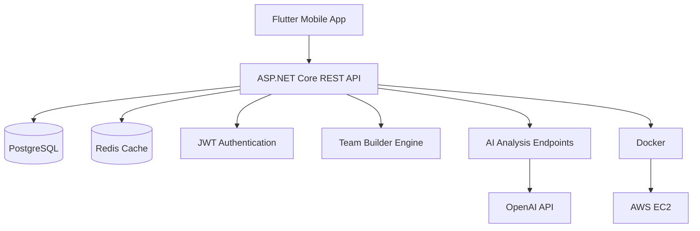
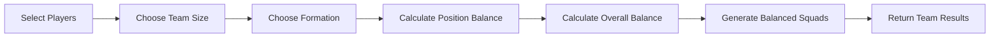
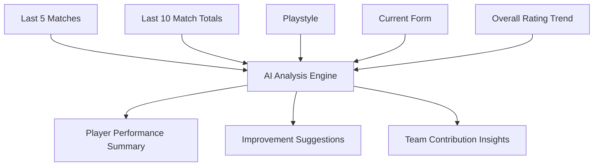
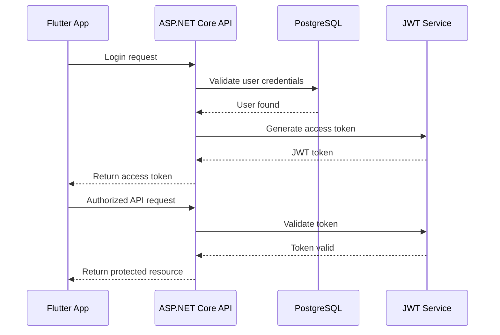
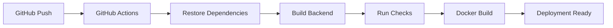
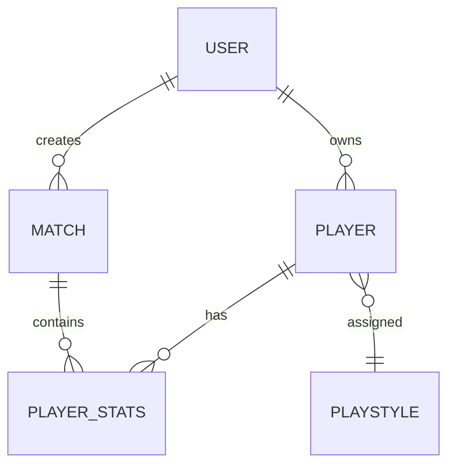

# Tactiq

**AI-Powered Football Team Builder & Player Performance Analytics Platform**

Tactiq is a mobile-first football analytics platform that helps amateur football teams manage players, track match statistics, generate balanced squads, and analyze player performance using statistical analysis and AI-assisted insights.

---

## ✨ Key Features

* 🤖 AI-assisted player performance analysis
* ⚽ Automatic balanced squad generation
* 📊 Player performance analytics
* 📱 Mobile-first architecture
* 🔐 JWT Authentication & Role-Based Authorization
* 🐳 Dockerized backend
* 📄 Swagger / OpenAPI documentation
* 🚀 CI/CD with GitHub Actions

---

## 📱 Screenshots

  
  
  

  
  

---

## 🏗️ Architecture

---

## ⚽ Team Builder Flow

---

## 🤖 AI Analysis Pipeline

---

## 🔐 Authentication Flow

---

## 🚀 CI/CD Pipeline

---

## 🗄️ Simplified Data Model

---

## 🛠️ Tech Stack

### Mobile

* Flutter

### Backend

* ASP.NET Core (.NET 9)
* RESTful API
* Entity Framework Core

### Database & Cache

* PostgreSQL
* Redis

### Authentication

* JWT Authentication
* Role-Based Authorization

### DevOps

* Docker
* GitHub Actions
* CI/CD

### Documentation

* Swagger / OpenAPI

### Deployment

* AWS EC2

---

## 📂 Project Structure

### 📱 Mobile App (`Tactiq/`)

Flutter application responsible for:

* Authentication
* Player management
* Match tracking
* Squad generation
* Player performance analytics

---

### 🌐 Backend API (`TactiqAPI/`)

ASP.NET Core REST API responsible for:

* JWT Authentication
* User management
* Player management
* Match management
* Team Builder algorithm
* Playstyle analysis
* AI integration endpoints
* Business logic

---

### 📄 Documentation

* Product roadmap
* Architecture planning
* Sprint planning
* API documentation

---

## 📚 Documentation

| Document                                 | Description                                            |
| ---------------------------------------- | ------------------------------------------------------ |
| 📄 [Product Roadmap](PRODUCT_ROADMAP.md) | Product vision, roadmap, architecture and future plans |

---

## 🌐 REST API

The backend exposes RESTful endpoints for:

* Authentication
* User management
* Player management
* Match management
* Team Builder
* Playstyle analysis
* AI integration

Interactive API documentation is available through Swagger after running the backend.

---

## 🚀 Roadmap

### ✅ Completed

* Backend API
* JWT Authentication
* Role-Based Authorization
* Player CRUD operations
* Match CRUD operations
* Team Builder algorithm
* Swagger documentation
* Docker support
* GitHub Actions workflow

### 🚧 In Progress

* Flutter mobile application
* AI player analysis
* Overall rating system
* Player form tracking
* Mobile UI polish

### 🔮 Planned

* Team performance dashboard
* Shareable squad images
* AI tactical suggestions
* Play Store release
* Advanced player analytics

---

## 🔮 Future Vision

Tactiq aims to become more than a football team builder.

The long-term vision is to provide amateur football teams with an intelligent platform for player management, tactical decision support, performance analytics, and AI-assisted insights while maintaining a simple and intuitive user experience.
